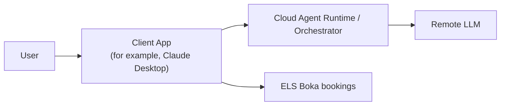

# Washing Bookings

ELS Boka is an Electrolux proprietary booking system that is widely used in Scandinavia for booking laundry and other services. This skill allows to manage bookings in that system.

Examples of client apps:

- Anthropic Claude Desktop
- Anthropic Claude Code
- OpenAI Codex
- OpenClaw Chat Channels

Examples of Agent Runtime

- Anthropic orchestrator
- OpenAI orchestrator
- OpenClaw Agent Runtime

Examples of LLM

- OpenAI Codex
- Anthropic Opus
- Meta Llama

## Initialization

Before being able to manage bookings, initialization should be complete. Initiation is essentially composing the config.yaml file that contains the following info:

- Service endpoint (base URL).
- Login credentials (user ID and password).
- A list of bookable facilities with UI control identifiers and allowed time slots.
- Weekly booking preferences (facility, day-of-week, and preferred time).

More details: [docs/initialization.md](docs/initialization.md)

## Check Current Bookings

Fetch current bookings and summarize results: [docs/checking-bookings.md](docs/checking-bookings.md).

## Make Regular Bookings

Current implementation only allows making weekly regular bookings. When the skill is initialized, user provides information about desired schedule for the weekly bookings: which day of week and what time should be booked. The skill is making the bookings according to the desired schedule: [docs/regular-bookings.md](docs/regular-bookings.md)
